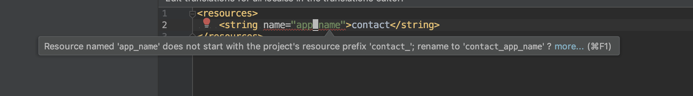

# 原因
不同模块对于资源的命名可能会有冲突，为了防止不同模块的资源应为命名冲突而被错误的覆盖，就需要一种机制能够检查、提示、修改冲突的资源。

## 例如有个模块contact，使用前缀contact_
- 文件contact/build.gradle 添加如下配置
```groovy
android{
    resourcePrefix 'contact_'
}
```
- 当打开资源时便会有如下警告


## 对所有项目统一设置
如果想对所有module应用，并不需要意义配置。可以使用 build.gradle统一设置
例如： 使用 module 名称 加上下划线作为 资源前缀，可以如下修改
build.gradle
```groovy
subprojects {
    afterEvaluate {
        android {
            resourcePrefix "${project.name}_"
        }
    }
}
```


或者使用写好的在线版本

```groovy
apply from: 'https://raw.githubusercontent.com/lotosbin/Best-Practices-in-Android-Development/master/xtask/tools/resource_prefix.gradle'
```